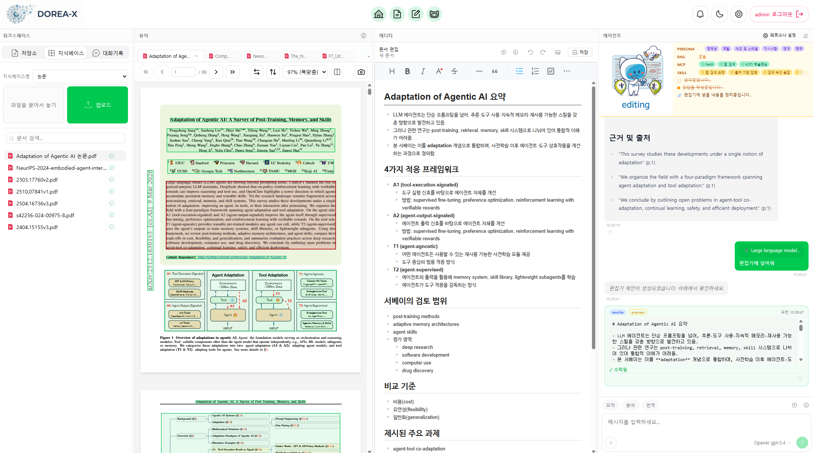
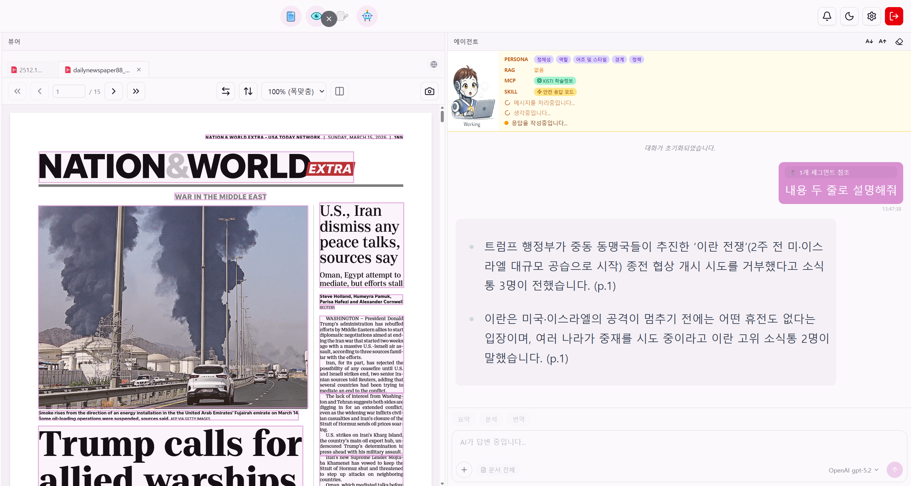
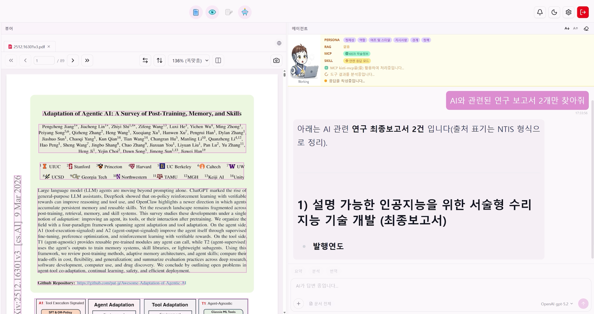
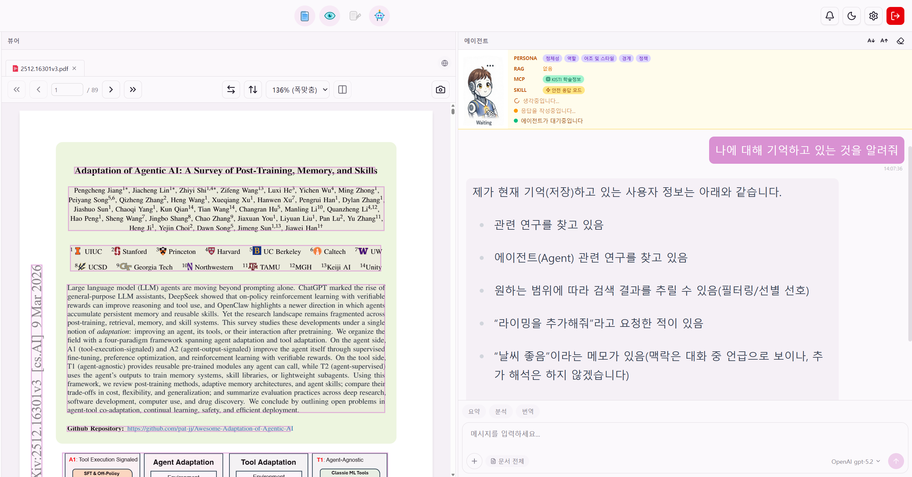
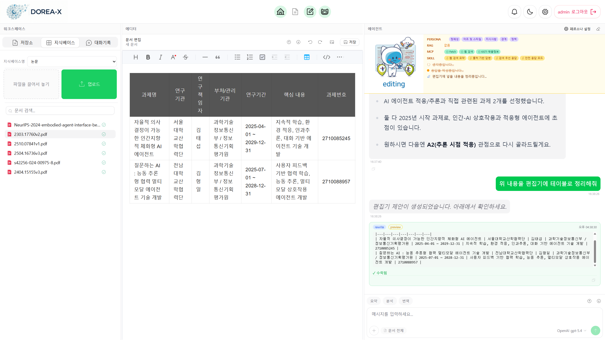

[한국어](README.md) | **English**

  
  

    
    
    
  

---

## 🆕 Latest News

> ### 🌐 Now on **TAW** — meet it as an agent!
>
> **DOREA-X** has joined **[The Agents Web (TAW)](https://github.com/leeryong/The_Agents_Web_TAW)** as an **agent**. No install needed — with a single **TAW Browser**, meet it **anywhere on PC or mobile** (Windows · macOS · Linux · iOS · Android), via **chat or its web app**.
>
> ➡️ **[The Agents Web (TAW)](https://github.com/leeryong/The_Agents_Web_TAW)** · 🌌 **[KISTI · BLUESKY](https://github.com/leeryong/KISTI_BLUESKY)**

## 🔎 Overview

### **DOREA–X (Document-Oriented Reasoning and Explanation Assistant - Gen. X)**

 **An AI agent that supports the entire process from document understanding to report writing**

- **Document-work AI agent**: A single agent handles every document task — document management, preprocessing, conversation, retrieval (RAG), and report writing
- **An AI colleague that works with you**: Beyond simply executing commands, a colleague that understands your flow, thinks alongside you, and collaborates
- **An expert ready for immediate deployment**: Applicable right away to diverse real-world tasks in research, administration, and education, without complex configuration
- **Expandable to various fields**: Not tied to any specific service — autonomously extends its capabilities as needed

### 📺 Demo Video (click to watch)

  ## 🌐 DOREA-X Distribution (DOREA-XP) Released

  We have released a distribution that distills the core features so anyone in research, education, or the workplace can get it and use it directly.

  ➡️ **[Go to DOREA-XP](DOREA-XP/)** — install with a single line, `./install/install.sh`, as long as Docker is installed

---

## 🚀 Key Features

- **Agent persona configuration**: Build your own customized colleague — an agent optimized for a specific role and goal
- **Document-based intelligent interaction**: Understands the structure of PDF/HWP/Office documents and conducts logical analysis and conversation grounded in the document content
- **Document-writing collaboration**: Assists throughout the entire writing process, from planning and drafting to final completion
- **Context-carrying working memory**: Manages conversation history and related documents on a per-project basis, providing a continuous working environment
- **Autonomous use of tools and skills**: Solves problems by autonomously selecting the tools (MCP/SKILL) it needs, such as document processing/analysis and web search
- **Multimodal document understanding**: Integrated understanding and analysis of unstructured documents containing text, tables, and images

<table>
<tr>
<td width="50%" align="center">

### 🤝 An agent that helps understand and analyze documents

• Real-time collaboration and document-based communication 
• From writing to editing, all in a single space

</td>
<td width="50%" align="center">

### 🛠️ An agent that uses tools on its own

• Autonomously selects tools such as web search and code execution 
• Derives the optimal solution without user intervention

</td>
</tr>
<tr>
<td width="50%" align="center">

### 🧠 An agent that understands the context of conversation and work

• Learns the user's conversation patterns and work history 
• Reflects prior context to skip unnecessary re-explanation

</td>
<td width="50%" align="center">

### ✍️ An agent that writes documents

• Understands multimodal documents with text, tables, and images 
• Supports the entire process from drafting to final review

</td>
</tr>
</table>

---

## 📞 Contact
- Ryong Lee (ryonglee@kisti.re.kr)

---

## 👨‍💻 Development Team

KISTI **BLUESKY** Team — *Harmonizing Human and AI Collaboration* · [github.com/leeryong/KISTI_BLUESKY](https://github.com/leeryong/KISTI_BLUESKY)

- Ryong Lee (ryonglee@kisti.re.kr)
- Raeyoung Jang (raezero@kisti.re.kr)
- Jahyun Gu (jahyeongu@kisti.re.kr)

---

## 📚 Open-Source Acknowledgements
- [OpenDataLoader](https://github.com/opendataloader-project)
- [Docling](https://github.com/DS4SD/docling)
- [Huridocs](https://github.com/huridocs/pdf-document-layout-analysis)
- [Ollama](https://github.com/ollama/ollama)
- [Mem0](https://github.com/mem0ai/mem0)
- [ChromaDB](https://github.com/chroma-core/chroma)
- [MarkItDown](https://github.com/microsoft/markitdown)
