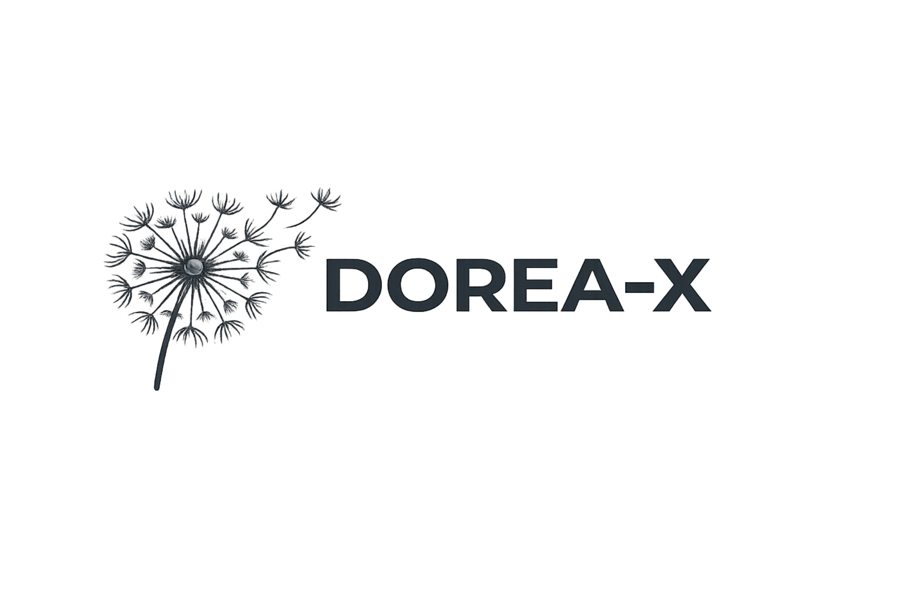

# DOREA-X  
**Document-Oriented Reasoning and Explanation Assistant – X (Cross-domain eXtensible)**

> 문서를 함께 읽고, 정리하고, 작성까지 도와주는 AI 에이전트

---

  

    <strong>Agentic Document-Oriented Reasoning and Explanation Assistant – X</strong>
  

  
  

    <strong>AI와 함께 문서를 쓰고, 검토하고, 완성하는 공간</strong>
  

  

   sample
    
    
    
  sample
  

---

## 🔎 Overview

- 문서 관리부터 전처리, 대화, 검색(RAG), 작성까지 문서 작업 전 과정을 함께하는 **AI 에이전트**
- 연구·행정·교육 등 다양한 분야에 바로 적용 가능한 범용 문서 작업 지원
- 사용자의 흐름을 이해하고 이어가며, 실제 업무를 함께 완성해주는 에이전트

### 📺 시연 영상

*이미지를 클릭하면 시연 영상으로 연결됩니다.*  
*음성: Generated using ElevenLabs (https://elevenlabs.io)*

---

## 🚀 주요 기능

- OCR·레이아웃 기반으로 문서를 구조적으로 이해하고 분석 지원
- 텍스트·이미지를 함께 다루는 멀티모달 RAG 기반 문서 검색·관리
- 개인화된 에이전트(페르소나)로 사용자 맞춤 문서 업무 지원
- 에이전트가 초안 작성부터 완성까지 문서 작성 보조
- 외부 정보(MCP/NTIS 등)를 연계해 필요한 자료를 자동 활용
- 메모리를 기반으로 사용자 맞춤형 대화와 지속적인 작업 지원

<table>
<tr>
<td width="50%" align="center">

### 🤝 같은 화면에서 함께 작업

사용자와 에이전트가 하나의 화면에서 같은 문서를 보며 실시간으로 대화하고 작업합니다.  
질문하고, 수정하고, 완성하는 모든 과정이 한 공간에서 이루어집니다.

</td>
<td width="50%" align="center">

### 🧠 맥락을 기억하는 에이전트

이전에 나눈 대화, 작업 방식, 관련 문서 내용을 기억해두고 다음에도 이어서 도와줍니다.  
매번 처음부터 설명하지 않아도 됩니다.

</td>
</tr>
<tr>
<td width="50%" align="center">

### 🛠️ 필요한 도구를 스스로 활용하는 에이전트

웹 검색, 일정 조회, 코드 실행 등 — 필요한 순간에 에이전트가 직접 도구를 꺼내 씁니다.  
사용자가 일일이 찾아볼 필요 없이, 에이전트가 스스로 해결합니다.

</td>
<td width="50%" align="center">

### ✍️ 에이전트와 함께 글쓰기

보고서 초안부터 완성까지, 에이전트가 옆에서 함께 써드립니다.  
텍스트, 표, 이미지가 포함된 복잡한 문서도 함께 정리하고 이해합니다.

</td>
</tr>
</table>

- **멀티모달 문서 이해** — 텍스트뿐 아니라 표, 이미지가 포함된 복잡한 문서도 통합적으로 읽고 이해합니다.
- **다양한 OCR·레이아웃 연동** — 여러 OCR 서비스나 문서 분석 도구와 유연하게 연결할 수 있습니다.
- **유연한 LLM 지원** — OpenAI GPT는 물론, 인터넷이 없는 환경에서도 쓸 수 있는 로컬 LLM(Ollama 등)을 지원합니다.
- **대화 기록 & 프로젝트 관리** — 나눈 대화와 문서를 프로젝트 단위로 저장하고 관리할 수 있습니다.

---

## ✨ 특징

- **함께 일하는 AI Agent**: 명령을 따르는 도구가 아니라, 함께 생각하는 동료처럼 작동합니다.
- **바로 쓸 수 있는 실용성**: 복잡한 설정 없이 실제 업무에 바로 투입할 수 있습니다.
- **내가 원하는 대로 확장**: 특정 프로그램이나 서비스에 얽매이지 않고 필요에 따라 기능을 추가할 수 있습니다.

---

## 개발자
- 이용 (Lee.Ryong@gmail.com)
- 장래영 (raezero@kisti.re.kr)
- 구자현 (jahyeongu@kisti.re.kr)

---

## 참고자료

