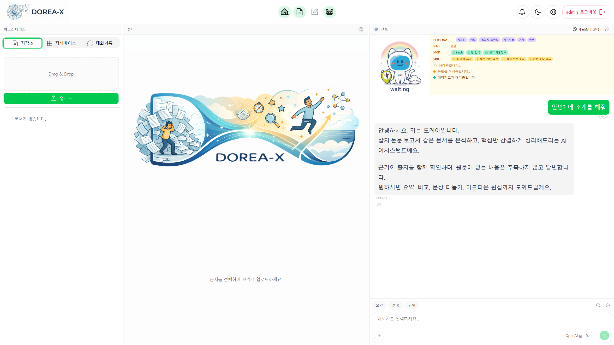
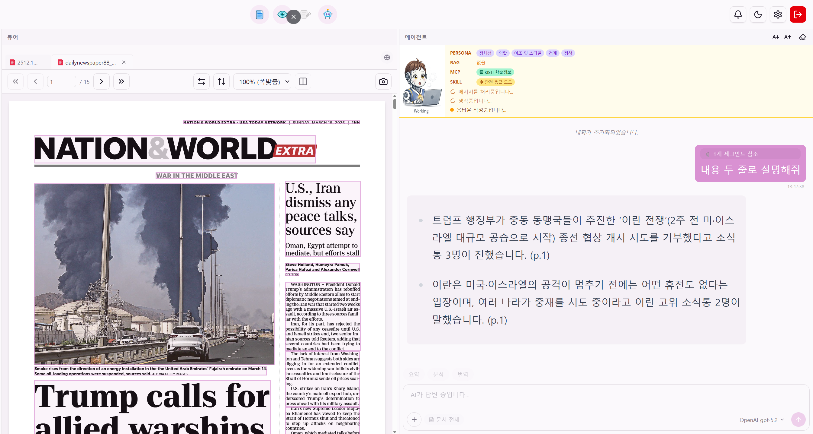
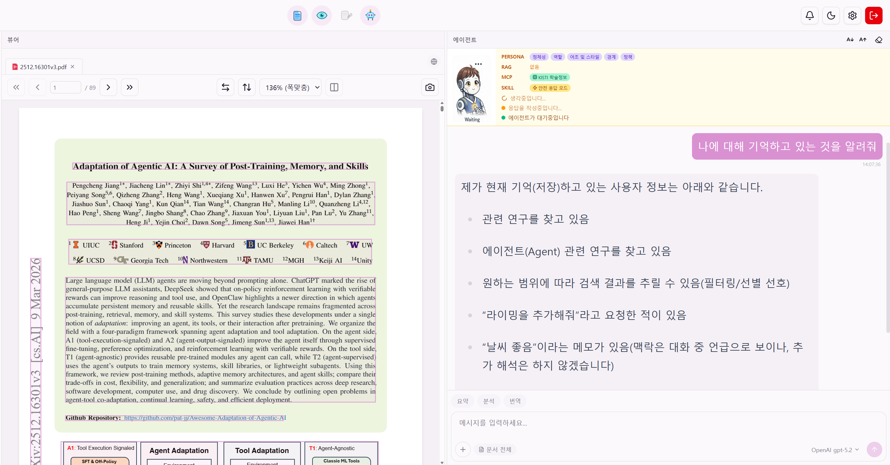
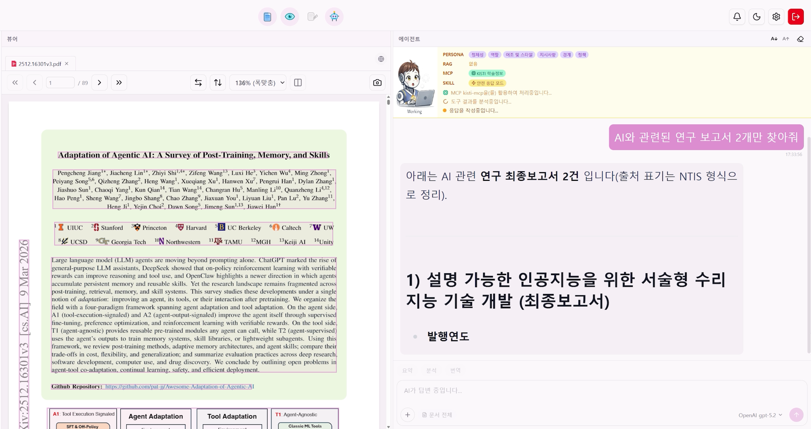
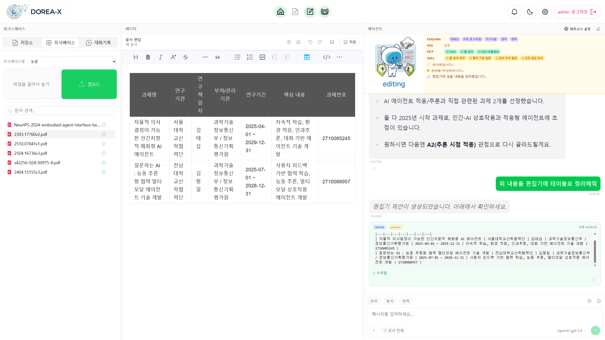

  
  

    
    
    
  

---

## 🔎 개요

### **DOREA(Document-Oriented Reasoning and Explanation Assistant)–X**

 **늘어가는 문서작업을 도와주는 AI 에이전트 시스템**

- **문서 작업 AI 에이전트**: 문서 관리·전처리·대화·검색(RAG)·보고서 작성까지 모든 문서 작업을 하나의 에이전트가 수행
- **함께 일하는 AI 동료**: 단순 명령 수행을 넘어, 사용자의 흐름을 이해하고 함께 고민하며 협업하는 동료
- **현장 즉시 투입 가능한 전문가**: 복잡한 설정 없이 연구·행정·교육 등 다양한 현업 업무에 바로 적용 가능
- **다양한 분야에 확대 적용 가능**: 특정 서비스에 종속되지 않고 필요에 따라 자율적으로 기능 확장

### 📺 시연 영상 (이미지 클릭 --> 시연영상 연결)

*음성: generated using ElevenLabs (https://elevenlabs.io)*

---

## 🚀 주요 기능

- **에이전트 페르소나 설정**: 역할과 목표에 최적화된 에이전트로 나만의 맞춤형 동료 구축
- **문서 기반 지능형 상호작용**: PDF/HWP/Office문서의 구조를 파악하고 문서 내용에 기반한 논리적 분석 및 대화
- **문서 작성 협업**: 기획과 초안 구상부터 최종 완성까지 문서 작성 전 과정을 함께 보조
- **맥락을 이어가는 작업 메모리**: 대화 내역과 관련 문서를 프로젝트 단위로 관리하여 연속성 있는 작업 환경 제공
- **자율적인 도구 및 스킬 활용**: 검색, 웹 API(MCP) 등 필요한 도구를 스스로 선택하여 문제 해결
- **멀티모달 문서 이해**: 텍스트, 표, 이미지가 포함된 비정형 문서의 통합적 이해 및 분석

<table>
<tr>
<td width="50%" align="center">

### 🤝 문서 이해와 분석을 도와주는 에이전트

• 실시간 협업 및 문서 기반 소통 
• 문서 작성부터 편집까지 단일 공간에서 제공

</td>
<td width="50%" align="center">

### 🧠 대화와 작업의 맥락을 이해하는 에이전트

• 사용자 대화 패턴 및 작업 히스토리 학습 
• 이전 맥락 반영하여 불필요한 재설명 생략

</td>
</tr>
<tr>
<td width="50%" align="center">

### 🛠️ 스스로 도구를 활용하는 에이전트

• 웹 검색, 코드 실행 등 도구 자율 선택 
• 사용자 개입 없이 최적의 해결 방법 도출

</td>
<td width="50%" align="center">

### ✍️ 문서를 작성하는 에이전트

• 텍스트, 표, 이미지 등 멀티모달 문서 이해 
• 초안 작성부터 최종 검토까지 전 과정 지원

</td>
</tr>
</table>

---

## 👨‍💻 개발자 그룹
- 이용 (Lee.Ryong@gmail.com), <-- 상담
- 장래영 (raezero@kisti.re.kr)
- 구자현 (jahyeongu@kisti.re.kr)

---

## 📚 활용 공개 소스
- [OpenDataLoader](https://github.com/opendataloader-project)
- [Docling](https://github.com/DS4SD/docling)
- [Huridocs](https://github.com/huridocs/pdf-document-layout-analysis)
- [Ollama](https://github.com/ollama/ollama)
- [Mem0](https://github.com/mem0ai/mem0)
- [ChromaDB](https://github.com/chroma-core/chroma)
- [MarkItDown](https://github.com/microsoft/markitdown)
