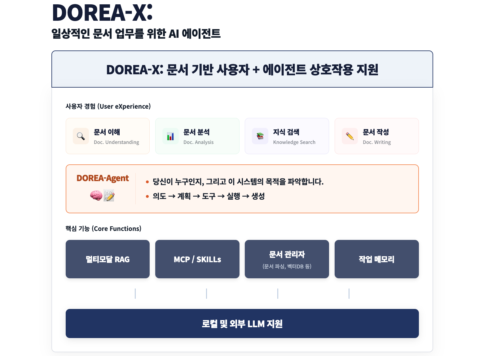

# DOREA-X  
**Document-Oriented Reasoning and Explanation Assistant – X (Cross-domain eXtensible)**

> 문서를 함께 읽고, 정리하고, 작성까지 도와주는 AI 에이전트

---

  

    <strong>Agentic Document-Oriented Reasoning and Explanation Assistant – X</strong>
  

  
  

    <strong>AI와 함께 문서를 쓰고, 검토하고, 완성하는 공간</strong>
  

  

    
    
    
  

---

## 🔎 Overview

- 문서 관리부터 전처리, 대화, 검색(RAG), 작성까지 문서 작업 전 과정을 함께하는 **AI 에이전트**
- 연구·행정·교육 등 다양한 분야에 바로 적용 가능한 범용 문서 작업 지원
- 사용자의 흐름을 이해하고 이어가며, 실제 업무를 함께 완성해주는 에이전트

### 📺 시연 영상

*이미지를 클릭하면 시연 영상으로 연결됩니다.*  
*음성: Generated using ElevenLabs (https://elevenlabs.io)*

---

## 🚀 주요 기능

- **사용자 맞춤형 페르소나 설정** — 역할과 목표에 최적화된 에이전트로 나만의 맞춤형 도우미 구축
- **문서 기반 지능형 상호작용** — PDF/HWP의 구조를 파악하고 문서 내용에 기반한 논리적인 분석 및 대화
- **에이전트와의 협업형 문서 작성** — 기획과 초안 구상부터 최종 완성까지 문서 작성 전 과정을 보조
- **맥락을 이어가는 작업 메모리** — 작업 히스토리를 기억하여 불필요한 설명 없이 연속성 있는 작업 환경 제공
- **자율적인 도구 및 스킬 활용** — 검색, 웹 API(MCP) 등 필요한 도구를 스스로 선택하여 문제 해결

<table>
<tr>
<td width="50%" align="center">

### 🤝 함께 작업하는 에이전트

• 실시간 협업 및 문서 기반 소통 
• 문서 작성부터 편집까지 단일 공간에서 제공

</td>
<td width="50%" align="center">

### 🧠 맥락을 기억하는 에이전트

• 사용자 대화 패턴 및 작업 히스토리 학습 
• 이전 맥락 반영하여 불필요한 재설명 생략

</td>
</tr>
<tr>
<td width="50%" align="center">

### 🛠️ 스스로 도구를 활용하는 에이전트

• 웹 검색, 코드 실행 등 도구 자율 선택 
• 사용자 개입 없이 최적의 해결 방법 도출

</td>
<td width="50%" align="center">

### ✍️ 문서를 작성하는 에이전트

• 텍스트, 표, 이미지 등 멀티모달 문서 이해 
• 초안 작성부터 최종 검토까지 전 과정 지원

</td>
</tr>
</table>

- **멀티모달 문서 이해** — 텍스트, 표, 이미지가 포함된 비정형 문서의 통합적 이해 및 분석
- **다양한 OCR·레이아웃 연동** — 상용 OCR 및 오픈소스 레이아웃 분석 도구와의 유연한 연결
- **유연한 LLM 지원** — 외부 API 모델부터 로컬 모델까지 환경에 따른 최적의 모델 활용
- **대화 기록 & 프로젝트 관리** — 업무별 대화 맥락과 관련 문서를 체계적으로 관리하는 프로젝트 단위 저장

---

## ✨ 특징

- **함께 일하는 AI Agent**: 단순한 명령 수행을 넘어 함께 고민하고 협업하는 동료로서의 역할
- **즉시 투입 가능한 실용성**: 복잡한 설정 없이 실제 현업 업무에 바로 적용 가능
- **유연한 맞춤형 확장성**: 특정 프로그램이나 서비스에 종속되지 않고 필요에 따라 자율적으로 기능 확장

---

## 🏗️ DOREA-X 시스템 구성도

  

- **사용자 경험 (UX)** — 문서 이해, 분석, 검색, 생성의 유기적 흐름 제공
- **지능형 에이전트 (Agent)** — 사용자 의도 분석 및 효율적인 도구 활용과 작업 수행
- **핵심 기능 (Core)** — 멀티모달 RAG, MCP, 문서 관리 및 지능형 작업 메모리
- **모델 지원 (LLM)** — 보안을 위한 로컬 모델 및 고성능 외부 모델 지원

---

## 개발자
- 이용 (Lee.Ryong@gmail.com)
- 장래영 (raezero@kisti.re.kr)
- 구자현 (jahyeongu@kisti.re.kr)

---

## 📚 참고자료

| 이름 | 용도 | 라이선스 |
| :--- | :--- | :--- |
| **[OpenDataLoader](https://github.com/opendataloader-project)** | 데이터 추출 및 전처리 파이프라인 | Apache-2.0 |
| **[Docling](https://github.com/DS4SD/docling)** | 고성능 문서 파싱 및 구조 분석 | MIT |
| **[Huridocs](https://github.com/huridocs/pdf-document-layout-analysis)** | PDF 레이아웃 분석 및 영역 분할 | Apache-2.0 |
| **[Ollama](https://github.com/ollama/ollama)** | 로컬 환경 언어 모델 실행 인프라 | MIT |
| **[Mem0](https://github.com/mem0ai/mem0)** | LLM용 지능형 개인화 작업 메모리 레이어 | Apache-2.0 |
| **[ChromaDB](https://github.com/chroma-core/chroma)** | AI 벡터 데이터베이스 및 검색 | Apache-2.0 |
| **[MarkItDown](https://github.com/microsoft/markitdown)** | 다양한 포맷의 문서를 Markdown으로 변환 | MIT |
| **[Qwen3-TTS](https://github.com/QwenLM/Qwen3-TTS)** | 고품질 음성 합성(Text-to-Speech) 모델 | Apache-2.0 |
| **[Qwen3-ASR](https://github.com/QwenLM/Qwen3-ASR)** | 자동 음성 인식(Automatic Speech Recognition) 모델 | Apache-2.0 |

